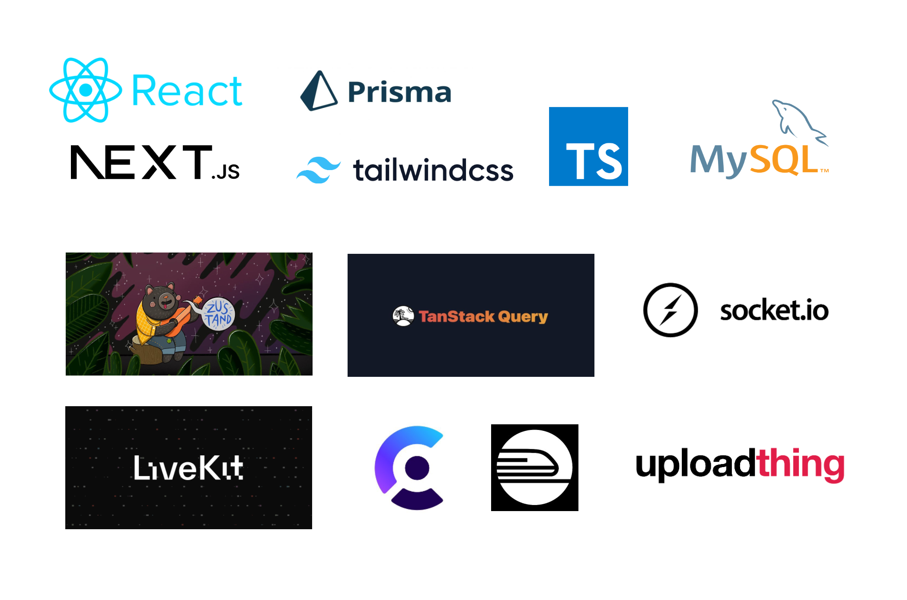

### 🛠️ Skill set

---

`React`, `Next.js 13`, `typescript`, `tailwind css`, `zustand`, `Socket.io`, `Prisma`, `MySQL`



### 📝 **Implemented features**

---

✅ CSS 관련 라이브러리 사용으로 웹, 모바일 반응형 및 재사용 가능한 UI 구현

- `next-theme` 을 이용한 라이트/다크 모드
- `Tailwind CSS` 및 `Shadcn UI` 를 `twMerge`, `clsx` **와 함께 사용해 유연한 컴포넌트 구현**

✅ 회원 관리 기능 구현

- 추방(Kick) 기능 및 권한 변경(Guest/Moderator) 기능 구현

✅ 고유의 초대 링크 생성 기능 구현

✅ 서버 생성 및 사용자 정의 기능 구현

✅ `LiveKit` api 를 이용한 오디오 및 비디오 콜 채널 생성 기능 구현

✅  `Clerk` api 를 이용해 로그인 기능 및 사용자 인증 기능 구현

✅ `Socket.io` 를 이용한 실시간 메시징 구현

- 양방향 통신 제공을 위해 `Socket.io` 사용
- 메세지를 일정 개수로 묶어 무한으로 로딩하는 기능을 `TanStack Query` ****를 사용하여 구현
- 메세지의 실시간 삭제 및 편집 가능 구현

**✅** `Uploadthing`을 이용한 첨부 파일 전송 기능

- 타입스크립트 어플리케이션 기반의 웹 서버 파일 업로더

✅ `Prisma`를 사용한 ORM 구현

✅ `Planetscale`을 사용한 MySQL 데이터베이스 구축

✅ `Railway`를 통한 배포

- [vercel을 이용한 배포를 하지 않은 이유](https://vercel.com/guides/do-vercel-serverless-functions-support-websocket-connections)

### ⚙️ Setup .env

---

```
NEXT_PUBLIC_CLERK_PUBLISHABLE_KEY=
CLERK_SECRET_KEY=
NEXT_PUBLIC_CLERK_SIGN_IN_URL=
NEXT_PUBLIC_CLERK_SIGN_UP_URL=
NEXT_PUBLIC_CLERK_AFTER_SIGN_IN_URL=
NEXT_PUBLIC_CLERK_AFTER_SIGN_UP_URL=

DATABASE_URL=

UPLOADTHING_SECRET=
UPLOADTHING_APP_ID=

LIVEKIT_API_KEY=
LIVEKIT_API_SECRET=
NEXT_PUBLIC_LIVEKIT_URL=
```
